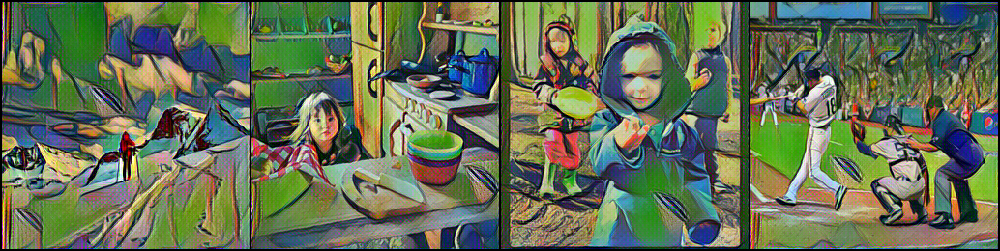

# style-transfer
Unofficial Implementation for perceptual losses for real-time style transfer and super-resolution

## To run
`bash dist_train.sh`

`dist_train.sh` is as follows,
```
CONFIG=styletransfer_vgg16_rain_princess
GPUS=2

python -m torch.distributed.launch --nproc_per_node $GPUS \
    --master_port 12345 dist_train.py \
    --cfg configs/$CONFIG.yaml
```

## Some results




## Ref code base
Microsoft/Swin-Transformer, pytorch/examples